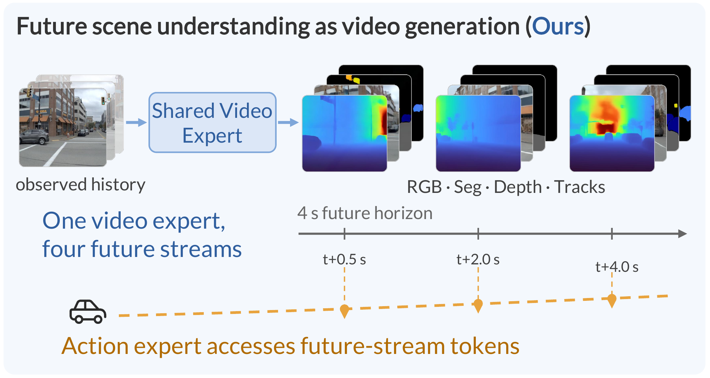
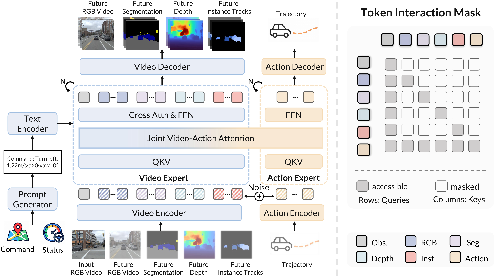
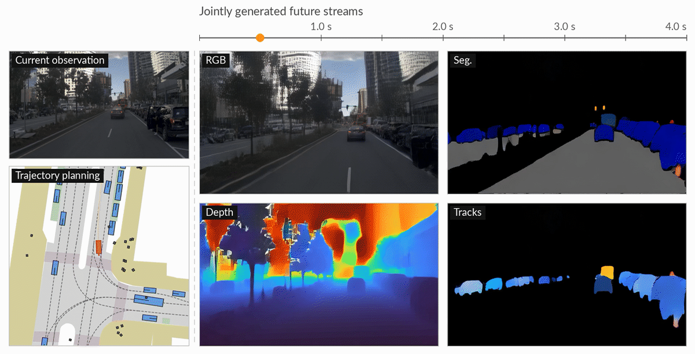
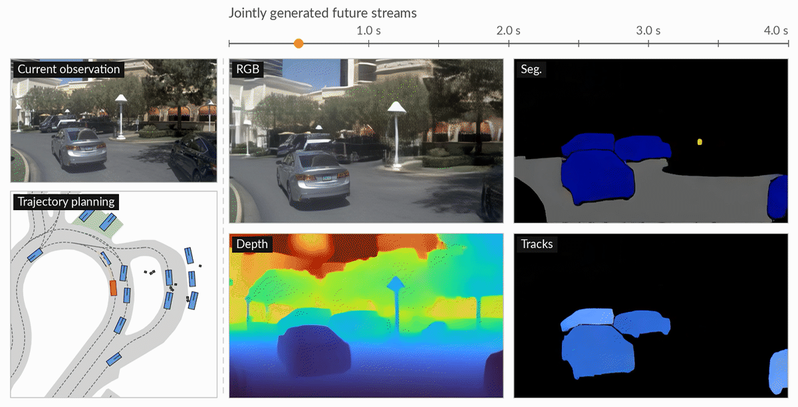
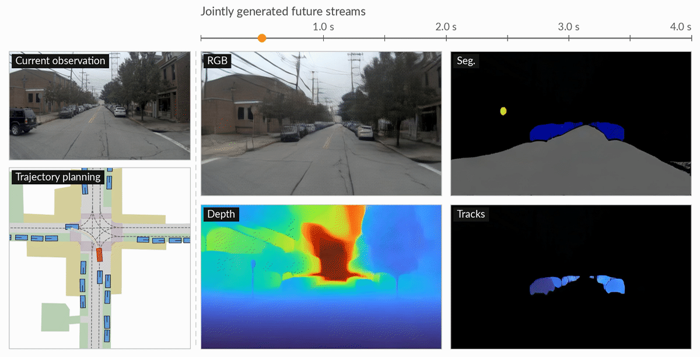
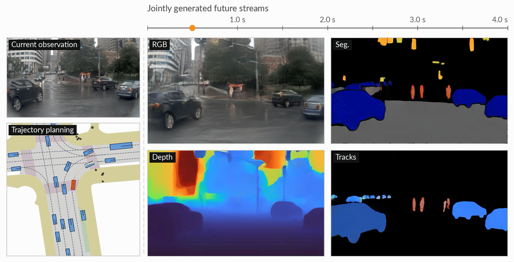
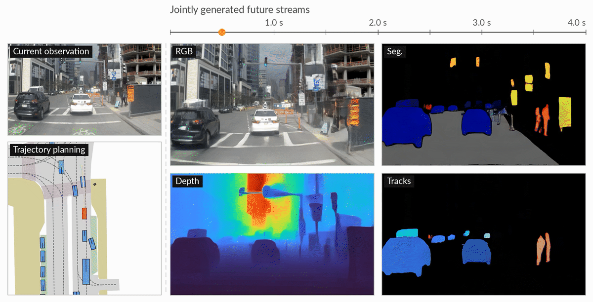

<div align="center">

# SUV: Future Scene Understanding as Video Generation for End-to-End Driving

<p>
  <a href="#citation"> arXiv</a>
  &nbsp;&nbsp;•&nbsp;&nbsp;
  <a href="#model-zoo">🤗 Model Zoo</a>
  &nbsp;&nbsp;•&nbsp;&nbsp;
  <a href="#evaluation">🚗 Evaluation</a>
</p>

</div>

<p align="center">
  
</p>

SUV formulates future scene understanding as video generation for end-to-end
driving. A shared video expert generates future RGB, segmentation, relative
depth, and instance-track streams, while an action expert attends to their
latent tokens to predict the ego trajectory. The model uses one front camera
and does not rely on candidate-trajectory selection.

## Authors

> - [Yibo Yuan](https://scholar.google.com/citations?user=ZimfkbYAAAAJ), [Jiacheng Fu](https://scholar.google.com/citations?user=-xnJpxsAAAAJ), [Jiangtong Zhu](https://scholar.google.com/citations?user=23Sy-mAAAAAJ), [Yi Li](https://scholar.google.com/citations?user=qGsK180AAAAJ), [Jianhua Han](https://scholar.google.com/citations?user=OEPMQEMAAAAJ), [Meng Tian](https://scholar.google.com/citations?user=btzoGAQAAAAJ), Zhuohan Liu, [Zhiwei Xiong](https://scholar.google.com/citations?user=Snl0HPEAAAAJ), [Hang Xu](https://scholar.google.com/citations?user=J_8TX6sAAAAJ), [Jianwu Fang](https://scholar.google.com/citations?user=hr8eDYsAAAAJ), and [Jianru Xue](https://scholar.google.com/citations?user=-qenJysAAAAJ)
> - **Paper:** arXiv link coming soon
> - If you have any questions, please feel free to contact: *Yibo Yuan* ([Yyb_XJTU@stu.xjtu.edu.cn](mailto:Yyb_XJTU@stu.xjtu.edu.cn)).

## Contents

- [Method](#method)
- [Demos](#qualitative-demos)
- [Results](#results)
- [Installation](#installation)
- [Evaluation](#evaluation)
- [Citation](#citation)

## TODO

- [x] Release the pretrained checkpoint, inference code, and
  NAVSIM v1/v2 evaluation.
- [ ] Release the training code and configurations.
- [ ] Release the structured-target preparation pipeline for
  segmentation, relative depth, and instance tracks.
- [ ] Release the WOD-E2E training and evaluation pipeline.

## Highlights

- **One video expert, four future streams.** SUV represents future appearance,
  semantic layout, scene geometry, and instance dynamics as native video
  streams without stream-specific visual prediction heads.
- **Future-aware trajectory planning.** Masked joint video-action attention
  lets the action expert read every future stream in latent space while
  preserving directed information flow.
- **Strong NAVSIM-v2 performance.** SUV reaches **91.0 EPDMS** on `navtest` and
  **36.9 EPDMS** on `navhard` with a single front camera.
- **Native multi-GPU evaluation.** Text-embedding preparation and NAVSIM v1/v2
  scoring shard work across the selected GPUs and merge results automatically.

## Method

<p align="center">
  
</p>

SUV initializes its shared video expert from Wan2.2-5B. Given a front-camera
observation history, navigation command, and ego state, it jointly denoises
four future video streams and the ego trajectory over a 4-second horizon. The
action expert reads future-stream tokens directly without decoding the videos.

## Qualitative Demos

Each example shows the current observation and planned ego trajectory alongside
jointly generated RGB, relative depth, semantic segmentation, and instance
tracks over the next four seconds.

<table align="center">
  <tr>
    <td align="center" colspan="2">
      <p><b>Lane Change</b></p>
      <a href="assets/demos/lane_change.mp4">
        
      </a>
    </td>
  </tr>
  <tr>
    <td align="center" width="50%">
      <p><b>Roundabout Negotiation</b></p>
      <a href="assets/demos/roundabout_negotiation.mp4">
        
      </a>
    </td>
    <td align="center" width="50%">
      <p><b>Unprotected Left Turn</b></p>
      <a href="assets/demos/unprotected_left_turn.mp4">
        
      </a>
    </td>
  </tr>
  <tr>
    <td align="center" width="50%">
      <p><b>Rainy Urban Intersection</b></p>
      <a href="assets/demos/rainy_urban_intersection.mp4">
        
      </a>
    </td>
    <td align="center" width="50%">
      <p><b>Construction Zone</b></p>
      <a href="assets/demos/construction_zone.mp4">
        
      </a>
    </td>
  </tr>
</table>

## Results

### NAVSIM v1 (↑ higher is better)

Results follow the official PDMS protocol. Baselines use their published sensor
and candidate configurations. SUV uses one front camera, ten solver steps, and
outputs one trajectory.

| Method | NC | DAC | TTC | Comfort | EP | PDMS |
| --- | ---: | ---: | ---: | ---: | ---: | ---: |
| Drive-JEPA | 98.7 | 96.2 | 100 | 95.5 | 82.9 | 89.0 |
| DriveVLA-W0 | 98.7 | 96.2 | 95.5 | 100 | 82.2 | 88.4 |
| AutoDrive-P3 | 99.1 | 97.4 | 96.5 | 100 | 84.8 | 90.6 |
| ReCogDrive | 97.9 | 97.3 | 94.9 | 100 | 87.3 | **90.8** |
| EponaV2 | 98.6 | 97.9 | 95.7 | 100 | 84.8 | 90.4 |
| Metis | 98.3 | 97.1 | 94.7 | 100 | 83.4 | 89.1 |
| Metis (Top 6) | 98.5 | 97.5 | 95.1 | 100 | 84.0 | 89.7 |
| **SUV** | 99.1 | 97.8 | 96.7 | 100 | 84.6 | **90.8** |

### NAVSIM v2

The following results use the corrected official EPDMS implementation. SUV
uses one front camera and ten solver steps. It does not use top-k trajectory
selection.

#### `navtest` (↑ higher is better)

| Method | Sensors | NC | DAC | DDC | TLC | EP | TTC | LK | HC | EC | EPDMS |
| --- | :---: | ---: | ---: | ---: | ---: | ---: | ---: | ---: | ---: | ---: | ---: |
| DriveVLA-W0 | 1×C | 98.4 | 95.2 | 99.4 | 99.9 | 86.6 | 97.9 | 97.8 | 98.3 | 82.7 | 86.9 |
| EponaV2 | 1×C | 98.5 | 97.4 | 99.5 | 99.9 | 87.9 | 98.1 | 97.7 | 98.2 | 77.4 | 88.9 |
| Metis | 1×C | 98.4 | 97.2 | 99.6 | 99.8 | 87.8 | 97.7 | 97.8 | 98.4 | 88.0 | 89.5 |
| Metis (Top 6) | 1×C | 98.5 | 97.5 | 99.6 | 99.8 | 87.9 | 97.8 | 98.0 | 98.4 | 90.0 | 90.3 |
| **SUV** | **1×C** | 99.1 | 97.8 | 99.7 | 99.8 | 87.8 | 98.7 | 98.1 | 98.4 | 88.3 | **91.0** |

#### `navhard` (↑ higher is better)

All listed methods use one front camera. S1 and S2 are the two official
`navhard` stages; EPDMS is the combined score.

| Method | Stage | NC | DAC | DDC | TLC | EP | TTC | LK | HC | EC | S. | EPDMS |
| --- | :---: | ---: | ---: | ---: | ---: | ---: | ---: | ---: | ---: | ---: | ---: | ---: |
| DriveVLA-W0 | S1 | 96.8 | 83.3 | 99.0 | 99.6 | 84.6 | 95.3 | 96.4 | 97.6 | 78.2 | - | 24.4 |
|  | S2 | 76.8 | 64.3 | 79.9 | 98.3 | 89.2 | 75.0 | 46.8 | 95.8 | 53.1 | - |  |
| EponaV2 | S1 | 97.3 | 90.7 | 99.4 | 100 | 83.3 | 97.3 | 97.3 | 97.6 | 60.9 | - | 36.1 |
|  | S2 | 83.6 | 78.0 | 88.0 | 98.9 | 86.0 | 80.3 | 50.1 | 96.1 | 52.0 | - |  |
| Metis | S1 | 96.6 | 87.8 | 99.0 | 99.3 | 84.5 | 95.6 | 97.8 | 97.8 | 77.8 | 75.8 | 32.2 |
|  | S2 | 79.6 | 73.3 | 84.9 | 97.8 | 85.8 | 76.6 | 47.7 | 95.4 | 75.3 | 41.7 |  |
| **SUV** | S1 | 96.9 | 94.2 | 99.3 | 99.6 | 84.1 | 95.6 | 96.7 | 97.8 | 79.6 | 82.3 | **36.9** |
|  | S2 | 82.7 | 74.2 | 85.9 | 98.4 | 86.0 | 78.9 | 47.2 | 95.9 | 69.1 | 43.9 |  |

## Model Zoo

The same SUV checkpoint supports NAVSIM v1 and NAVSIM v2 evaluation.

| Model | Video backbone | Input | Checkpoint |
| --- | --- | --- | --- |
| SUV | Wan2.2-TI2V-5B | Single front camera | Coming soon |

The public checkpoint URL and checksum will be added before release. Set the
single `CKPT_LOCAL_DIR` path at the top of each evaluation script after
downloading the release files.

## Installation

```bash
# Install the SUV environment
conda create -n suv python=3.10 -y
conda activate suv
pip install -U pip
pip install torch==2.7.1+cu128 torchvision==0.22.1+cu128 \
  --extra-index-url https://download.pytorch.org/whl/cu128
pip install -e .

# Install NAVSIM
git clone https://github.com/autonomousvision/navsim.git /path/to/navsim
pip install -e /path/to/navsim
```

## Data Preparation

Download the NAVSIM logs, camera sensor blobs, NuPlan maps, and official metric
caches by following the corresponding NAVSIM instructions. The expected common
paths are:

```bash
export OPENSCENE_DATA_ROOT=/path/to/navsim
export NUPLAN_MAPS_ROOT=/path/to/navsim/maps
export NAVSIM_EXP_ROOT=/path/to/evaluation_outputs
```

The configured `CKPT_LOCAL_DIR` contains `suv_navsim.pt` and the public
Wan2.2-TI2V-5B components. Set `TEXT_EMBEDDING_CACHE_DIR` separately for the
generated prompt embeddings. The SUV checkpoint contains the video/action
expert weights, so a separate ActionDiT checkpoint is not required.

The default dataset layout is:

```text
${OPENSCENE_DATA_ROOT}/
├── navsim_logs/test
├── sensor_blobs/test
└── navhard_two_stage/
    ├── sensor_blobs
    └── synthetic_scene_pickles
```

## Evaluation

Text embeddings depend on the dynamic driving prompts and must be prepared once
before scoring. All preparation and evaluation entrypoints default to four-GPU
sharding with `CUDA_VISIBLE_DEVICES=0,1,2,3`; set it to a single ID only when a
single-GPU run is required.

### NAVSIM v1

NAVSIM v1 uses the package installed in the active environment:

```bash
CUDA_VISIBLE_DEVICES=0,1,2,3 \
bash experiments/navsimv1/scripts/evaluation/precompute_suv_navsimv1_pdm_text_embeds.sh

METRIC_CACHE_PATH=/path/to/navsim_v1/metric_cache \
CUDA_VISIBLE_DEVICES=0,1,2,3 \
bash experiments/navsimv1/scripts/evaluation/run_pdm_score.sh
```

See the [NAVSIM v1 evaluation guide](experiments/navsimv1/README.md) for path
overrides and multi-GPU options.

### NAVSIM v2 `navtest`

NAVSIM v2 uses the vendored evaluation devkit by default. Build the shared text
embedding cache once; this command includes both `navtest` and
`navhard_two_stage` prompts:

```bash
CUDA_VISIBLE_DEVICES=0,1,2,3 \
bash experiments/navsimv2/scripts/evaluation/precompute_text_embeddings.sh

METRIC_CACHE_PATH=/path/to/navsim_v2/metric_cache \
CUDA_VISIBLE_DEVICES=0,1,2,3 \
bash experiments/navsimv2/scripts/evaluation/run_epdm_score.sh
```

### NAVSIM v2 `navhard`

Configure the reactive two-stage assets first:

```bash
export SYNTHETIC_SENSOR_PATH=/path/to/navhard_two_stage/sensor_blobs
export SYNTHETIC_SCENES_PATH=/path/to/navhard_two_stage/synthetic_scene_pickles
export METRIC_CACHE_PATH=/path/to/navsim_v2/navhard_metric_cache
```

Create the metric cache if it is not already available, then run the official
two-stage scorer. The shared text embeddings prepared above already include
the `navhard_two_stage` prompts:

```bash
bash experiments/navsimv2/scripts/run_navhard_metric_caching.sh

CUDA_VISIBLE_DEVICES=0,1,2,3 \
bash experiments/navsimv2/scripts/evaluation/run_navhard_epdm_score.sh
```

See the [NAVSIM v2 evaluation guide](experiments/navsimv2/README.md) for the
complete path configuration.

## Repository Structure

```text
src/suv/               SUV model loading and inference
experiments/navsimv1/  NAVSIM v1 adapter and official PDM evaluation
experiments/navsimv2/  NAVSIM v2 adapter, devkit, and official EPDMS evaluation
```

## Citation

The public paper link and BibTeX entry will be added when available.

## Acknowledgements

SUV builds on Wan2.2 and the NAVSIM/NuPlan evaluation ecosystem. We thank the
authors and maintainers of these projects for releasing their code, models,
datasets, and benchmarks. Please follow their licenses and citation requests.

## License

SUV is released under the [MIT License](LICENSE). Vendored third-party files
retain their original license headers and terms.
